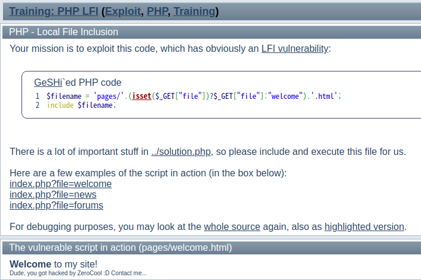
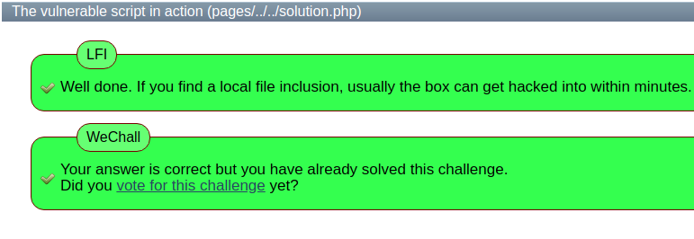
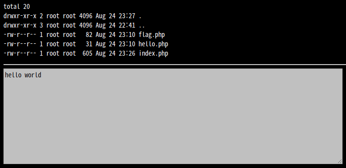
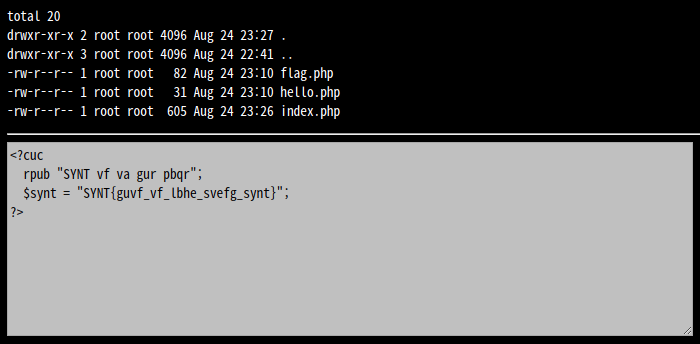

# File Inclusion - LFI

LFI는 Local File Inclusion의 약자로, 외부에서 원격으로 파일을 가져오는 RFI와 다르게 로컬 서버의 파일을 포함하여 공격하는 방식이다. PHP에서 `include` 함수를 사용하여 파일을 포함시킬 때 입력하는 파일의 경로를 적절히 필터링하지 않으면 취약점이 발생한다. 주로 경로 탐색 취약점과 함께 사용되는 경우가 많다.

아래의 PHP 코드는 LFI가 발생할 수 있는 간단한 예시이다.

```php
<?php
    $file = $_GET['file'];
    if(isset($file)) {
        include("pages/$file");
    } else {
        include("index.php");
    }
?>
```
`file` 파라미터에 입력되는 파일을 `include` 하여 작업을 수행하게 된다. 여기서 만약 다른 디렉토리의 파일에 접근할 수 있다면 파일 내용을 노출시키는 등의 악의적인 작업을 수행할 수 있다.

```
http://www.example.com/index.php?file=content.php
```
위의 URL에서는 `content.php` 파일을 `include` 한다는 것을 알 수 있다. `file` 파라미터로 입력되는 값이 따로 필터링되지 않기 때문에 `/etc/passwd` 와 같이 보안적으로 민감한 파일에 접근할 수 있을 것이다. `/etc/passwd` 는 UNIX 계열 시스템에서 서버의 모든 패스워드를 담고 있는 파일이다. 아래는 경로 탐색 취약점을 이용하여 파일에 접근하는 예시이다.

```
http://www.example.com/index.php?file=../../../../etc/passwd
```
---

LFI와 관련해서 간단한 워게임 문제를 찾아보았다.

첫 번째 문제는 [WeChall](https://www.wechall.net)의 **Training: PHP LFI**이다.



문제를 보면 `file` 파라미터를 이용하여 해당 파일을 하단에 출력하는 것을 확인할 수 있다. 바로 목표인 `solution.php` 파일에 접근해보기로 하였다. 하지만 `solution` 이라고만 입력하면 `html` 파일 확장자를 자동으로 붙이기 때문에 `solution.html` 이 된다. 그리고 `index.php` 파일이 있는 디렉토리 기준으로 한 단계 상위 디렉토리에 파일이 존재하기 때문에 `pages` 디렉토리 기준으로는 두 단계 상위 디렉토리가 된다.

따라서 `?file=../../solution.php%00` 처럼 상위 디렉토리로 올라간 후에 접근하고자 하는 파일을 입력하고 나서 `html` 확장자가 붙는 것을 막기 위해 뒤를 `%00` 과 같은 널바이트로 마무리 해주어야 한다.



두 번째 문제는 [Webhacking.kr](https://webhacking.kr/)의 **old-25**이다.



이 문제도 URL을 보면 `file` 파라미터로 해당 디렉토리의 파일에 접근하여 하단에 내용을 출력해준다는 것을 알 수 있다. 플래그 값을 알아내기 위해 파라미터에 `flag` 를 입력해봤는데 코드 안에 플래그가 있다는 내용이 출력되었다.

이 문제는 감이 잡히지 않아서 도움을 받아 해결하였다. 핵심은 **PHP Wrapper**이다. PHP Wrapper는 PHP 자체의 입출력 스트림, 표준 입출력 등을 조작할 수 있는 여러 I/O 스트림을 제공한다.

우리는 플래그 값을 얻기 위해서 `flag` 파일의 코드를 결과값으로 볼 수 있어야 한다. 나는 php.net의 공식 문서를 참고하여 `php://filter` 를 활용하기로 하였다. 예시를 보면 아래와 같이 접근하는 것을 볼 수 있다.

```
php://filter/read=string.rot13/resource=http://www.example.com
```
해당 경로의 파일을 rot13으로 변환하여 읽어들이는 구조이다. 이를 응용하여 경로를 `flag` 로 접근해보면 아래와 같은 출력을 얻을 수 있다.



PHP 코드가 rot13으로 변환되었기 때문에 일반 텍스트 파일로 읽힌 것을 확인할 수 있다. 이것을 다시 원래대로 변환하면 플래그 값을 획득할 수 있다.